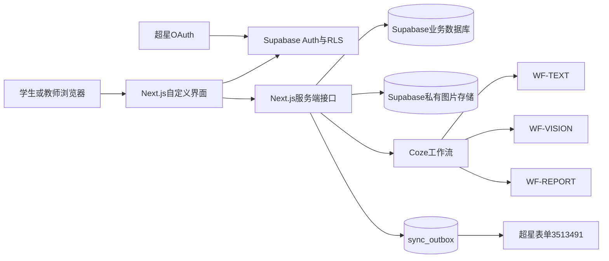

# 生物化学文字实验双智能体——Coze平台交付与后续推进说明

> 文档版本：1.0.0  
> 交付日期：2026-08-14  
> 适用对象：Coze实施工程师、后端开发、前端开发、测试、运维、超星接口负责人、课程教师  
> 项目定位：学生实验智能体 + 教师分析智能体，不是传统实验填报或成绩管理系统。

## 1. 交付结论与状态

当前交付已经完成可独立构建的应用代码、双智能体页面、八步状态控制、Supabase迁移、演示身份、Coze服务端适配器、超星表单outbox、知识材料归档、结构化知识文件、测试及生产构建。

以下事项由于依赖外部平台正式凭证或权限，代码已预留，但交付时不能宣称已经完成真实生产联调：

| 能力 | 当前状态 | 启用条件 |
|---|---|---|
| Supabase业务数据库 | 迁移、RLS、RPC和种子脚本已完成 | Coze方提供真实Supabase项目并执行迁移 |
| WF-TEXT | 服务端适配器与节点规范已完成 | 在Coze创建工作流并配置ID与Token |
| WF-VISION | 服务端适配器与节点规范已完成 | 在Coze创建视觉工作流并配置多模态模型 |
| WF-REPORT | 服务端适配器与节点规范已完成 | 在Coze创建报告工作流并配置ID |
| 超星表单同步 | outbox与Worker已完成 | 获得表单外部写入地址、鉴权、限流和回查规则 |
| 超星OAuth | 回调路由和身份映射已保留 | 获得APPID、APPKEY、武汉大学fid和正式HTTPS域名 |

## 2. 核心功能

### 2.1 学生实验智能体

- 通过连续对话带学生完成八步文字实验。
- 普通提问、草稿和正式提交分开处理，普通聊天不会消耗正式修改次数。
- 正式提交后判断已说明内容、遗漏、错误、模糊表达、参数、顺序和安全问题。
- 确定性Gate规则优先于模型语义判断，模型不能覆盖温度、时间、浓度、关键试剂、顺序和安全规则。
- 对不足内容进行分层追问，不直接泄露整份标准答案。
- 支持老师标准图片题、仪器识别、结果图判断和学生图片上传。
- 完成八步后生成学习情况与改进报告，不代写正式实验报告。

### 2.2 教师分析智能体

- 使用自然语言查询班级进度、步骤完成率、高频遗漏和待复核记录。
- 统计数字由服务端数据库聚合，不让大模型编造人数或比例。
- 单个学生结论必须关联原始回答、评阅或图片证据。
- 支持教师复核和可选补充意见，教师意见为空不阻塞学生完成。
- 教师只能访问被授权课程和班级。

### 2.3 八步实验

1. 目标基因与引物设计。
2. pET28表达载体构建。
3. BL21转化与IPTG诱导表达。
4. SDS-PAGE表达及可溶性判断。
5. 蛋白纯化方法选择。
6. 蛋白纯化操作。
7. 蛋白纯度验证。
8. 蛋白浓度测定与完整实验回顾。

## 3. 总体架构



安全边界：Coze Token、Supabase Service Role Key、超星APPKEY只能存在于服务端环境变量中，浏览器不能持有这些凭证。

## 4. 交付包目录

```text
delivery/
├─ project/                         全量项目源码与配置
│  ├─ src/                          前端、接口、双智能体业务代码
│  ├─ supabase/migrations/          数据库迁移、RLS、RPC
│  ├─ scripts/                      构建、导入、打包与校验脚本
│  ├─ docs/                         架构、工作流和平台说明
│  ├─ knowledge-base/
│  │  ├─ raw-teacher-materials/     老师原始DOCX/PPTX/图片
│  │  └─ structured/                结构化八步知识与来源哈希
│  ├─ public/course-assets/         授权课程图片
│  ├─ tests/                        自动化测试
│  ├─ .env.example                  无真实密钥的配置模板
│  └─ package.json/pnpm-lock.yaml   依赖清单与锁文件
├─ compiled-build.tar.gz            已编译的.next与dist/server.js
├─ DELIVERY-MANIFEST.json           文件、大小和SHA-256清单
├─ SHA256SUMS.txt                    逐文件校验值
└─ 交付说明.txt                      快速入口
```

老师原始材料属于校内受控内容，不应进入公开代码仓库或公开下载地址。

## 5. 环境变量

以`.env.example`为唯一字段模板，至少配置：

| 变量 | 必需时间 | 用途 |
|---|---|---|
| `COZE_SUPABASE_URL` | 数据库联调前 | Supabase项目地址 |
| `COZE_SUPABASE_ANON_KEY` | 数据库联调前 | 浏览器受RLS约束访问 |
| `COZE_SUPABASE_SERVICE_ROLE_KEY` | 迁移后 | 演示账号、内容种子和服务端任务 |
| `COZE_API_BASE_URL` | AI联调前 | Coze工作流API地址 |
| `COZE_API_TOKEN` | AI联调前 | 服务端调用Coze |
| `COZE_WF_TEXT_ID` | 文字评阅联调前 | WF-TEXT ID |
| `COZE_WF_VISION_ID` | 图片联调前 | WF-VISION ID |
| `COZE_WF_REPORT_ID` | 报告联调前 | WF-REPORT ID |
| `ENABLE_DEMO_ACCESS` | 开发阶段 | 开启演示学生与教师 |
| `ENABLE_UI_PREVIEW` | 仅设计验收 | 开启只读UI预览路由；生产必须关闭 |
| `ENABLE_AI_FIXTURE` | 仅开发 | 模拟AI响应；生产必须关闭 |
| `CHAOXING_APP_ID/APP_KEY` | OAuth阶段 | 超星开放平台凭证 |
| `CHAOXING_ALLOWED_FIDS` | OAuth阶段 | 仅允许武汉大学fid |
| `CHAOXING_FORM_WRITE_URL` | 表单联调前 | 获得授权的外部写入地址 |
| `CHAOXING_FORM_TOKEN` | 表单联调前 | 表单写入鉴权 |
| `CHAOXING_FORM_ID` | 表单联调前 | 默认 `3513491` |
| `CHAOXING_FORM_TRANSPORT` | 表单联调前 | `disabled`、`taskflow` 或 `api` |
| `CHAOXING_FORM_READBACK_URL` | 回查联调前 | 可选的只读回查地址 |
| `CHAOXING_FORM_RATE_LIMIT` | 表单联调前 | 应用侧每秒请求上限 |
| `SYNC_WORKER_SECRET` | 同步Worker上线前 | 内部任务鉴权 |

禁止把真实`.env`、完整Token、Cookie、localStorage、Service Role Key或超星APPKEY放入代码仓库、截图、日志和工单。

## 6. 首次部署操作

### 6.1 安装与构建

```bash
corepack enable
pnpm install --frozen-lockfile
pnpm validate
pnpm test
pnpm export:knowledge
pnpm build
```

验收：TypeScript、ESLint和自动化测试全部通过，`.next/BUILD_ID`存在。

### 6.2 创建Supabase

1. 在Coze项目中创建或绑定真实Supabase实例。
2. 保存项目URL、Anon Key和Service Role Key到服务端密钥配置。
3. 按文件名顺序执行`supabase/migrations/`中的迁移。
4. 检查所有业务表已启用RLS。
5. 使用两个不同学生账号验证互相不能读取对方数据。
6. 执行`pnpm seed:content`导入八步内容、评分点、仪器和图片题。
7. 执行查询确认八步连续、评分点完整且知识来源可追溯。

迁移执行前应先备份现有Schema；生产环境不得直接修改已执行迁移文件，应新增迁移。

### 6.3 创建三个Coze工作流

按以下节点说明创建：

- `docs/coze/WF-TEXT.md`
- `docs/coze/WF-VISION.md`
- `docs/coze/WF-REPORT.md`

工作流输出必须使用文档定义的JSON Schema。后端对Schema进行校验，失败时重试一次，仍失败则返回保守反馈并写入`ai_jobs`。

### 6.4 启用演示身份

1. 设置`ENABLE_DEMO_ACCESS=true`。
2. 设置稳定的演示学生和演示教师邮箱。
3. 分别进入两个演示入口。
4. 确认两者均产生标准Supabase Session，不使用第二套Cookie。
5. 检查教师可以查询授权班级，学生只能读取自己的记录。

### 6.5 部署应用

可选方式：

- Coze平台按模板执行`scripts/build.sh`、`scripts/start.sh`。
- Node环境进入`project`执行`pnpm install --frozen-lockfile`，再把`compiled-build.tar.gz`解压到项目根目录并运行`pnpm start`。
- Dockerfile会在Linux容器内重新执行锁定依赖安装和生产构建，运行镜像携带生产依赖并用`next start`启动。

生产环境至少要求HTTPS、反向代理请求体限制、图片上传大小限制、访问日志脱敏和健康检查。

## 7. API调用规范

### 7.1 统一响应

```ts
type ApiResult<T> =
  | { ok: true; data: T; requestId: string }
  | {
      ok: false;
      error: { code: string; message: string; retryable: boolean };
      requestId: string;
    };
```

所有正式提交必须带唯一`requestId`；重复请求不得产生重复评阅或重复超星记录。

### 7.2 学生接口

| 方法 | 地址 | 说明 |
|---|---|---|
| POST | `/api/student/session` | 创建或恢复八步会话 |
| GET/POST | `/api/student/messages` | 获取消息或发送普通提问 |
| POST | `/api/student/evaluate` | 正式提交本步描述 |
| POST | `/api/student/image-question` | 获取当前步骤图片题 |
| POST | `/api/student/media/upload` | 获取私有签名上传票据 |
| POST | `/api/student/media/evaluate` | 图片上传完成并触发评阅 |
| POST | `/api/student/report` | 生成学习情况与改进报告 |

### 7.3 教师接口

| 方法 | 地址 | 说明 |
|---|---|---|
| POST | `/api/teacher/session` | 创建教师分析会话 |
| POST | `/api/teacher/query` | 进度、遗漏、待复核和学生证据查询 |
| POST | `/api/teacher/reviews` | 保存复核或补充意见 |

### 7.4 内部接口

`POST /api/internal/sync-chaoxing`只能由调度器携带`SYNC_WORKER_SECRET`调用，不得暴露给浏览器。

### 7.5 错误码

- `AUTH_REQUIRED`：未登录或Session失效。
- `FORBIDDEN`：角色或课程权限不足。
- `STATE_INVALID`：步骤状态不允许当前操作。
- `VALIDATION_ERROR`：请求字段或回答不符合要求。
- `AI_OUTPUT_INVALID`：Coze输出不符合Schema。
- `AI_TIMEOUT`：工作流超时。
- `MEDIA_QUALITY_LOW`：图片质量不足。
- `RESOURCE_MISSING`：知识或课程资源不存在。
- `SYNC_DEFERRED`：超星同步已进入异步重试，不影响主业务。

## 8. 权限配置

### 8.1 角色

- `student`：自己的会话、消息、图片、进度和报告。
- `teacher`：被授权课程和班级的统计、证据、复核记录。
- `content_admin`：第一版不提供公开界面，仅用于受控内容导入。
- `service_role`：仅服务端任务使用，绕过RLS前必须校验业务权限。

### 8.2 存储

- `course-assets`：课程授权资源；只读发布。
- `student-media`：私有桶，按用户路径隔离，读取使用短时签名URL。
- 图片URL不能永久公开，日志不得记录签名查询参数。

### 8.3 审计

教师复核、内容导入、角色映射、同步和关键状态变化写入`audit_logs`或`event_logs`。日志至少保存请求ID、操作者、对象、动作、结果和时间，不保存完整密钥。

## 9. 超星身份认证启用

认证最后启用，但上线前必须完成：

1. 在超星开放平台创建应用并申请OAuth用户身份权限。
2. 登记Coze预览域名和正式域名的HTTPS回调地址。
3. 回调固定为`/api/auth/callback/chaoxing`，不得随意增加多套回调逻辑。
4. 配置`CHAOXING_APP_ID`、`CHAOXING_APP_KEY`、允许的武汉大学fid。
5. 验证授权码只能使用一次，state校验有效，回调重放被拒绝。
6. 将超星uid、学工号、fid和角色绑定到`external_identities`与`profiles`。
7. 验证学生和教师进入不同智能体，且使用同一套Supabase Session和RLS。
8. 关闭`ENABLE_DEMO_ACCESS`和`ENABLE_UI_PREVIEW`，确认演示路由返回404。
9. 执行XSS、CSP、Cookie Secure/SameSite和退出登录测试。

不得通过复制浏览器Cookie或爬取内部登录接口替代正式OAuth。

## 10. 超星表单数据接入

表单ID：`3513491`。字段：

- `student_id`
- `step_id`
- `version_no`
- `student_answer`
- `ai_feedback`
- `gate_status`
- `total_score`
- `ai_confidence`
- `evidence_image`
- `teacher_comment`
- `final_report`

接入流程：

1. 向超星取得正式外部调用地址、鉴权方式、限流、错误码、文件字段格式和数据回查接口。
2. 在测试表单完成新增、重复提交、超时、429、5xx和参数错误验证。
3. 业务提交和`sync_outbox`在同一Supabase事务完成。
4. Worker按`event_id`幂等写入，学生操作不等待超星返回。
5. 429、超时和5xx指数退避；权限和参数错误进入人工处理。
6. 写入后使用正式回查能力核对关键字段。
7. 超星接口关闭时，学生仍能完成八步和生成报告。

没有正式接口授权时，只允许保留待同步事件，禁止使用浏览器内部接口作为生产写入方式。

## 11. 知识库维护

### 11.1 材料组成

- 老师5份核心DOCX。
- 14份课程PPTX。
- 13张仪器和实验结果图片。
- 八步结构化SOP、关键点、三层提示、Gate和图片题JSON。

### 11.2 更新流程

1. 将新材料放入`knowledge-base/raw-teacher-materials/`。
2. 记录来源、版本、负责人和适用步骤。
3. 执行`pnpm export:knowledge`更新结构化导出及源文件哈希。
4. 课程老师复核冲突、参数和安全项。
5. 执行`pnpm seed:content`导入测试环境。
6. 运行固定文字和图片测试集。
7. 发布新内容版本，不覆盖旧版本。

原始材料冲突时标记“待教师确认”，不得让模型自行选择一个结论。

## 12. 测试与上线验收

### 12.1 自动化命令

```bash
pnpm validate
pnpm test
pnpm build
```

### 12.2 必测业务

- 普通提问不触发正式评阅。
- 步骤不能通过URL跳过。
- 回答和评阅只新增版本，不覆盖历史。
- 安全错误必须阻断。
- 合理替代方案和低置信结果进入教师复核。
- 两名学生数据完全隔离。
- 教师只能查询授权班级。
- 图片模糊、无关、缺少Marker或泳道说明时不强行下结论。
- 报告不虚构未完成步骤或实验结果。
- 超星失败不阻断智能体主流程。

### 12.3 UI验收

- PC和手机均呈现“科学探险日志/实验记录册”界面，不是普通蓝白后台。
- 使用暖白水彩背景、浅纸张卡片、蓝珊瑚路线和 Gate 状态语义；不使用厚皮革、线圈或拟物化书脊。
- 手机端使用底部导航和单栏流程，不是桌面端缩小。
- 关键按钮、输入框、图片和证据可真实操作。

## 13. 常见问题排查

### 无法启动，提示Supabase变量缺失

检查`.env`是否配置URL和Anon Key。只读UI预览可临时开启`ENABLE_UI_PREVIEW=true`，正式业务接口仍必须配置Supabase。

### 学生点击正式提交后一直处理中

查看`ai_jobs`、服务端requestId和Coze工作流日志。确认工作流ID、Token、超时和输出Schema。禁止直接把内部异常原文展示给学生。

### AI返回了文本但接口提示`AI_OUTPUT_INVALID`

Coze结束节点没有输出纯JSON或字段名不一致。按工作流文档修正，尤其检查`decision`、`scores`、`questions`和`knowledgeChunkIds`。

### 图片上传成功但无法读取

检查是否写入`student-media`私有桶、对象路径是否以用户ID开头、签名URL是否过期以及RLS是否允许当前学生访问。

### 教师统计与数据库不一致

教师统计必须走服务端确定性聚合。核对课程、班级、时间和步骤筛选范围，不能让大模型重新计算人数。

### 超星一直显示待同步

检查`CHAOXING_FORM_WRITE_URL`、Token、Worker调度和`sync_outbox.last_error`。接口未授权时保持pending是正确行为，不应删除事件。

### 超星登录后回到错误页

核对平台登记回调与实际域名、HTTPS、state、允许fid和APPID。不要使用内网地址或临时端口作为正式回调。

## 14. 后续工作与迭代排期

以下时间从Coze方获得完整账号、密钥和接口权限后的第一个工作日计算。

| 阶段 | 建议周期 | 工作 | 交付与验收 |
|---|---:|---|---|
| V1.0平台联调 | 第1周 | Supabase迁移、内容导入、三个Coze工作流、演示身份 | 八步文字闭环、图片闭环、报告闭环通过 |
| V1.1教师联调 | 第2周 | 教师查询、证据、复核、班级授权 | 统计与数据库一致，越权测试通过 |
| V1.2超星数据 | 第3周 | 表单新增、重试、幂等、回查 | 超星故障不阻断业务，重复同步无重复记录 |
| V1.3统一认证 | 第4周 | OAuth、fid、角色映射、关闭演示入口 | 学生/教师正确进入对应智能体 |
| V1.4课程试点 | 第5—6周 | 小班试用、教师复核样本、提示词评估 | 安全漏判为0，收集问题并形成修订清单 |
| V1.5正式发布 | 第7周 | 性能、安全、备份、监控、发布和回滚演练 | 生产健康、告警有效、回滚可执行 |

排期前提：超星权限、Coze模型额度、Supabase实例、域名和老师确认材料必须按阶段到位。外部权限延迟应单独记录，不把“代码已完成”写成“平台已打通”。

## 15. 功能优化建议

优先级P0：

- 完成真实WF-TEXT/WF-VISION/WF-REPORT联调。
- 完成RLS双学生隔离和教师越权测试。
- 完成超星OAuth和表单外部接口正式授权。
- 建立安全关键错误固定测试集。

优先级P1：

- 增加教师查看原文、图片和规则版本的完整复核卡。
- 建立提示词版本、测试集版本和教师修正闭环。
- 增加任务队列监控、失败重放和管理员告警。
- 优化手机端长对话、图片预览和报告折叠。

优先级P2：

- 增加课程资料搜索、术语表和已完成步骤版本对比。
- 增加无障碍键盘操作和屏幕阅读器说明。
- 对大班统计增加缓存和分页。

## 16. 维护保障与问题响应

### 16.1 日常维护

- 每日检查AI任务失败、同步积压和异常登录。
- 每周抽查教师复核不一致项、安全漏判和低置信比例。
- 每月验证备份恢复、密钥轮换清单和依赖安全更新。
- 每次课程内容更新必须保留旧版本和来源哈希。

### 16.2 响应机制

| 等级 | 示例 | 首次响应 | 临时处置目标 | 根因报告 |
|---|---|---:|---:|---:|
| P0 | 数据泄露、越权、安全错误漏判、全站不可用 | 30分钟 | 4小时内隔离或回滚 | 2个工作日 |
| P1 | 正式提交、报告或OAuth大面积失败 | 2小时 | 1个工作日 | 3个工作日 |
| P2 | 单一功能异常、部分图片或同步失败 | 1个工作日 | 3个工作日 | 按需 |
| P3 | 文案、样式或非阻断优化 | 2个工作日 | 纳入迭代 | 不要求 |

问题单至少包含环境、账号角色、课程/班级、requestId、发生时间、复现步骤、预期结果和脱敏截图。禁止附带完整密钥和Cookie。

## 17. 发布、备份与回滚

发布前：

1. 备份Supabase数据库和Storage对象清单。
2. 保存上一版部署包、数据库迁移版本、Coze工作流版本和知识库版本。
3. 在预览环境运行固定测试集。
4. 灰度开放一个班级并观察错误率和队列积压。

回滚时：

- 应用回滚到上一份已校验的完整交付包或容器镜像。
- Coze工作流切回上一版本ID或发布版本。
- 数据库只执行经过验证的前向修复迁移，不直接删除生产表。
- 知识内容切换为上一已发布版本，不覆盖学生历史记录。

## 18. 最终移交核对表

- [ ] 交付ZIP可解压，文件清单和SHA-256全部通过。
- [ ] 无真实`.env`、Token、APPKEY、Cookie或Service Role Key。
- [ ] 源代码、锁文件、Supabase迁移、脚本和编译产物齐全。
- [ ] 老师原始材料、结构化知识和课程图片齐全。
- [ ] 三个Coze工作流文档和输出Schema齐全。
- [ ] PC、手机、学生端和教师端截图及设计QA齐全。
- [ ] `pnpm validate`、`pnpm test`和生产构建通过。
- [ ] 外部未完成事项已明确标记，未将“待授权”写成“已打通”。
- [ ] 超星OAuth、表单同步和正式域名负责人已确认。
- [ ] 监控、备份、回滚和问题响应机制已确认。

## 19. 相关文件

- `README.md`
- `docs/智能体架构与运行.md`
- `docs/coze/WF-TEXT.md`
- `docs/coze/WF-VISION.md`
- `docs/coze/WF-REPORT.md`
- `supabase/migrations/202608140001_agent_core.sql`
- `supabase/migrations/202608190001_profiles_role_lockdown.sql`
- `docs/数据库映射说明-Coze原生模型.md`
- `knowledge-base/README.md`
- `.env.example`
